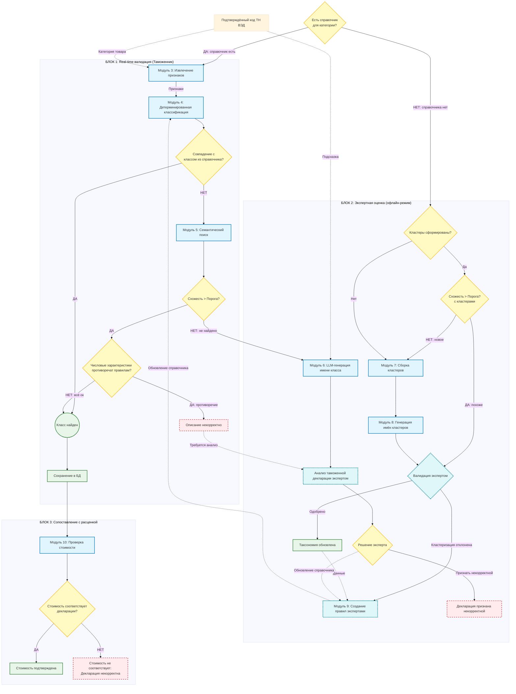

# Pipeline

Схема модулей и потоков обработки (Mermaid).



## Декомпозиция на микросервисы

Ниже — **фактический контур**, который реально поднимается в текущем `docker-compose.yml`.

| Compose-сервис | Назначение | Статус реализации |
|---|---|---|
| `api-gateway` | Единая точка входа (`/api/validate`, `/ready`, прокси к backend/orchestrator/preprocessing) | рабочий |
| `orchestrator` | Сквозной pipeline: `officer-run -> price-validator -> enqueue job` | рабочий |
| `backend` (`rules-engine`) | CRUD правил, настройки feature extraction, `officer-run` | рабочий |
| `preprocessing` | Интеграция с Ollama, deploy/pause/delete моделей, генерация | рабочий |
| `llm-naming` | Генерация имени класса через Ollama, fallback на stub | рабочий (с fallback) |
| `semantic-search` | Семантический поиск для fallback-ветки | **stub** |
| `price-validator` | Проверка цены в pipeline | **stub** (`accepted_info_only`) |
| `clustering-service` | Воркер очереди jobs + выбор кандидатов (k-means по эмбеддингам) | частично (job-run stub, candidate selection рабочий) |
| `postgres` | БД правил и очереди jobs | рабочий |
| `frontend-expert` | UI эксперта (`VITE_UI_MODE=expert`) | рабочий |
| `frontend-officer` | UI инспектора (`VITE_UI_MODE=officer`) | рабочий |
| `ollama` | LLM runtime для `preprocessing` и `llm-naming` | рабочий |

**Что реально используется как хранилища сейчас:**
- `postgres` (`pgdata`) — правила, настройки, очередь jobs;
- `ollama_data` — локальные модели Ollama.

Отдельная векторная БД в текущем `compose` не поднята.

## Генерация системного промпта извлечения признаков (кнопка «Сгенерировать основу промпта из справочника»)

Здесь **два разных места правки**, не путать с текстом промпта конфигурации в UI (он хранится в DSL правила в БД).

| Что менять | Где в репозитории | Формат |
|---|---|---|
| **Мета-инструкция для LLM «промпт-инженера»** — текст, который задаёт роль, структуру и требования к выходному системному промпту | `frontend/src/expert/featureExtractionPromptGenerator.ts` — константа `FEATURE_EXTRACTION_PROMPT_GENERATOR_META` и логика сборки запроса в `buildFeatureExtractionPromptGeneratorRequest` | Исходный код (TypeScript), не YAML |
| **Параметры вызова Ollama** для этого запроса (`num_ctx`, `temperature`, `max_new_tokens`, …) | По умолчанию: `services/api-gateway/config/prompt_generator.json`. Переопределение пути: переменная окружения `PROMPT_GENERATOR_CONFIG_PATH` (см. `services/api-gateway/app/prompt_generator_config.py`). Файл перечитывается на каждый запрос. | JSON |
| Дополнительные значения по умолчанию в коде (если JSON отсутствует или неполный) | `services/api-gateway/app/prompt_generator_config.py` — словарь `CODE_DEFAULT` | Python |

**Исходные данные справочника** (шаблон JSON, допустимые значения), которые подмешиваются в запрос к генератору, берутся из DSL правила: `meta.numeric_characteristics_draft` (редактируется в мастере каталога и сохраняется в БД вместе с правилом, не отдельным yaml-файлом в репозитории).

Диагностика текущего эффективного конфига генератора: `GET /api/feature-extraction/prompt-generator-config` на `api-gateway`.

## Контекстная диаграмма

Диаграмма ниже отражает предметный контекст (не список контейнеров `docker-compose` один-к-одному).

```plantuml
@startuml
!include https://raw.githubusercontent.com/plantuml-stdlib/C4-PlantUML/master/C4_Container.puml

title System Context: Automated Classification System

Person(customsOfficer, "Таможенник", "Проверяет декларации на границе")
Person_Ext(declarant, "Декларант", "Подает ДТ")
Person_Ext(expert, "Эксперт", "Настраивает правила классификации")

System(SystemAA, "Система классификации", "Автоматическая валидация ДТ")
System_Ext(SystemF, "Валидация цен", "Внешний сервис ФТС")
System_Ext(SystemC, "ФТС/ФНС", "Контролирующие органы")
SystemDb_Ext(SystemE, "Исторические ДТ", "Архив для аналитики")

Rel(declarant, customsOfficer, "Декларация")
Rel(customsOfficer, SystemAA, "Отправляет декларацию")
Rel(SystemAA, customsOfficer, "Статус валидации")
Rel(expert, SystemAA, "Настраивает правила")
Rel(SystemAA, expert, "Запрос на ручную валидацию")
Rel(SystemAA, SystemF, "Проверка цены")
Rel(SystemF, SystemC, "Отчёт по валидации")
Rel(SystemAA, SystemC, "Передача результатов")
Rel(SystemAA, SystemE, "Сохранение истории")
Rel(SystemC, declarant, "Проверка/штрафы", "пост-контроль")
@enduml
```

## Запуск MVP-контурa (test mode)

### 1) Сборка и старт

```powershell
docker compose build
docker compose up -d
docker compose ps
```

### 2) Ollama и модель

```powershell
docker compose exec ollama ollama pull llama3.1:8b
```

В `docker-compose.yml` для `ollama` сейчас включено `gpus: all`. Если GPU/Tookit недоступны на хосте, временно уберите эту строку и перезапустите стек.

Если сервис не поднят:

```powershell
docker compose up -d ollama
```

### 3) Порты сервисов

- `8081` - `frontend-expert` (Expert UI, nginx)
- `8082` - `frontend-officer` (Officer UI, nginx)
- `8000` - `api-gateway`
- `8003` - `orchestrator`
- `8004` - `preprocessing`
- `8005` - `backend` (`rules-engine`)
- `8001` - `semantic-search`
- `8002` - `llm-naming` (`llm-generator`)
- `8006` - `price-validator`
- `8007` - `clustering-service`
- `11434` - `ollama`

### 4) Health/Ready проверки

```powershell
Invoke-RestMethod -Uri "http://localhost:8000/ready" | ConvertTo-Json -Depth 6
Invoke-RestMethod -Uri "http://localhost:8000/health"
Invoke-RestMethod -Uri "http://localhost:8003/health"
Invoke-RestMethod -Uri "http://localhost:8007/ready"
```

### 5) Smoke test сквозного пайплайна

```powershell
$body = @{
  declaration_id = "DT-TEST-001"
  description    = "Карбамид гранулированный 46% азота"
  tnved_code     = "3102101000"
} | ConvertTo-Json

Invoke-RestMethod -Uri "http://localhost:8000/api/validate" `
  -Method Post -ContentType "application/json" -Body $body | ConvertTo-Json -Depth 8
```

Проверка статуса фоновой job:

```powershell
Invoke-RestMethod -Uri "http://localhost:8000/api/jobs/1" | ConvertTo-Json -Depth 8
```

### 6) Остановка

```powershell
docker compose down
```

С удалением volume БД (полный сброс тестовых данных):

```powershell
docker compose down -v
```

## Развёртывание на сервере

### Требования к хосту

- Docker Engine + `docker compose`
- Ресурсы под PostgreSQL и Ollama (RAM/диск)

### Подготовка

Создайте `.env` рядом с `docker-compose.yml`:

```env
POSTGRES_PASSWORD=сложный_секрет
OLLAMA_MODEL=llama3.1:8b
# OLLAMA_BASE_URL=http://адрес:11434
```

Секреты не храните в Git.

### Базовый запуск

```powershell
docker compose build
docker compose up -d
docker compose ps
```

### Обновление

```powershell
git pull
docker compose build
docker compose up -d
```

### Минимальные проверки после деплоя

- `docker compose ps`
- `Invoke-RestMethod http://<host>:8000/ready`
- `docker compose exec ollama ollama list`

## Контейнерная диаграмма (фактический compose-контур)

@startuml
!include <C4/C4_Container>

left to right direction
skinparam nodesep 10
skinparam ranksep 60
skinparam padding 10
skinparam defaultFontSize 16

title Система валидации ДТ (Контейнерная диаграмма)

Boundary(SystemBoundary, "") {
    
    Container(ExpertUI, "Интерфейс эксперта", "Nginx + React + TypeScript (Vite build)", "Управление правилами и моделями")
    Container(OfficerUI, "Интерфейс инспектора", "Nginx + React + TypeScript (Vite build)", "Прогон ДТ и мониторинг")

    Container(ApiGateway, "Шлюз API", "FastAPI + Uvicorn", "Агрегация API, ретраи, проксирование")
    Container(Orchestrator, "Оркестратор", "FastAPI + Uvicorn", "Координация пайплайна валидации")
    Container(PreprocessingSvc, "Сервис предобработки", "FastAPI + Uvicorn + Ollama HTTP", "Извлечение признаков и управление LLM")
    Container(RulesEngine, "Движок правил (backend)", "FastAPI + SQLAlchemy + PostgreSQL", "CRUD правил и классификация")
    Container(SemanticSearch, "Семантический поиск", "FastAPI + PostgreSQL (pgvector)", "Векторный поиск похожих товаров")
    Container(LlmGenerator, "Генерация классов", "FastAPI + Ollama HTTP", "Генерация названия класса")
    Container(PriceValidator, "Проверка стоимости", "FastAPI + Uvicorn", "Сверка цены с внешним сервисом")

    Container(ClusteringService, "Сервис кластеризации", "FastAPI + sentence-transformers + scikit-learn", "Фоновая обработка задач кластеризации")
    Container(Ollama, "Ollama", "ollama/ollama", "Локальный LLM runtime")

    ContainerDb(Postgres, "PostgreSQL", "PostgreSQL 16 (+ pgvector)", "Правила, задачи кластеризации, результаты, векторы")
}

System_Ext(PriceService, "Сервис цен ФТС", "API", "Рыночные цены")
System_Ext(FtsSystem, "Шлюз ФТС/ФНС", "HTTPS/XML", "Контролирующие органы")

' === Relations ===
Rel(OfficerUI, ApiGateway, "HTTPS /api")
Rel(ExpertUI, ApiGateway, "HTTPS /api")
Rel(ExpertUI, ApiGateway, "Few-shot: запуск кластеризации", "REST")
Rel(ApiGateway, Orchestrator, "Валидация ДТ", "REST")

Rel(Orchestrator, PreprocessingSvc, "Текст ДТ")
Rel(PreprocessingSvc, Orchestrator, "Признаки")
Rel(Orchestrator, RulesEngine, "Поиск правила")
Rel(Orchestrator, SemanticSearch, "Поиск похожих")
Rel(Orchestrator, LlmGenerator, "Генерация имени")
Rel(Orchestrator, PriceValidator, "Проверка цены")

Rel(RulesEngine, Postgres, "CRUD правил", "SQL")
Rel(SemanticSearch, Postgres, "pgvector поиск", "SQL")
Rel(PreprocessingSvc, Ollama, "Pull/Generate model", "HTTP")
Rel(LlmGenerator, Ollama, "Generate class name", "HTTP")

Rel(Orchestrator, Postgres, "Создание задач кластеризации", "SQL")
Rel(Postgres, ClusteringService, "Выбор задач (SKIP LOCKED)", "SQL")
Rel(ClusteringService, Postgres, "Запись результата и снятие блокировки", "SQL")

Rel(OfficerUI, ApiGateway, "Подписка на статус", "WebSocket/SSE")
Rel(ApiGateway, Postgres, "LISTEN статусов задач", "SQL")
Rel(ApiGateway, ClusteringService, "Few-shot assist / clustering", "REST")

Rel(PriceValidator, PriceService, "Запрос цены", "HTTPS (Timeout -> Cache)")
Rel(ApiGateway, FtsSystem, "Отчетность / Результаты", "HTTPS/XML")

' === Styling ===
UpdateElementStyle(ExpertUI, $fontColor="#00838f", $bgColor="#e0f7fa", $borderColor="#00838f")
UpdateElementStyle(OfficerUI, $fontColor="#0277bd", $bgColor="#e1f5fe", $borderColor="#0277bd")
UpdateElementStyle(ApiGateway, $fontColor="#0d47a1", $bgColor="#e3f2fd", $borderColor="#0d47a1")
UpdateElementStyle(Orchestrator, $fontColor="#1b5e20", $bgColor="#c8e6c9", $borderColor="#1b5e20")
UpdateElementStyle(PreprocessingSvc, $fontColor="#1b5e20", $bgColor="#f1f8e9", $borderColor="#1b5e20")
UpdateElementStyle(RulesEngine, $fontColor="#1b5e20", $bgColor="#f1f8e9", $borderColor="#1b5e20")
UpdateElementStyle(ClusteringService, $fontColor="#e65100", $bgColor="#ffe0b2", $borderColor="#e65100")
UpdateElementStyle(Postgres, $fontColor="#2e7d32", $bgColor="#e8f5e9", $borderColor="#2e7d32")
UpdateElementStyle(Ollama, $fontColor="#6a1b9a", $bgColor="#f3e5f5", $borderColor="#6a1b9a")

Legend right
  <#1b5e20>■</color> Core Services (Sync)
  <#e65100>■</color> Async Worker (ML)
  <#2e7d32>■</color> PostgreSQL (правила/задачи)
  <#6a1b9a>■</color> LLM Runtime (Ollama)
  <#0277bd>■</color> UI
endLegend

@enduml