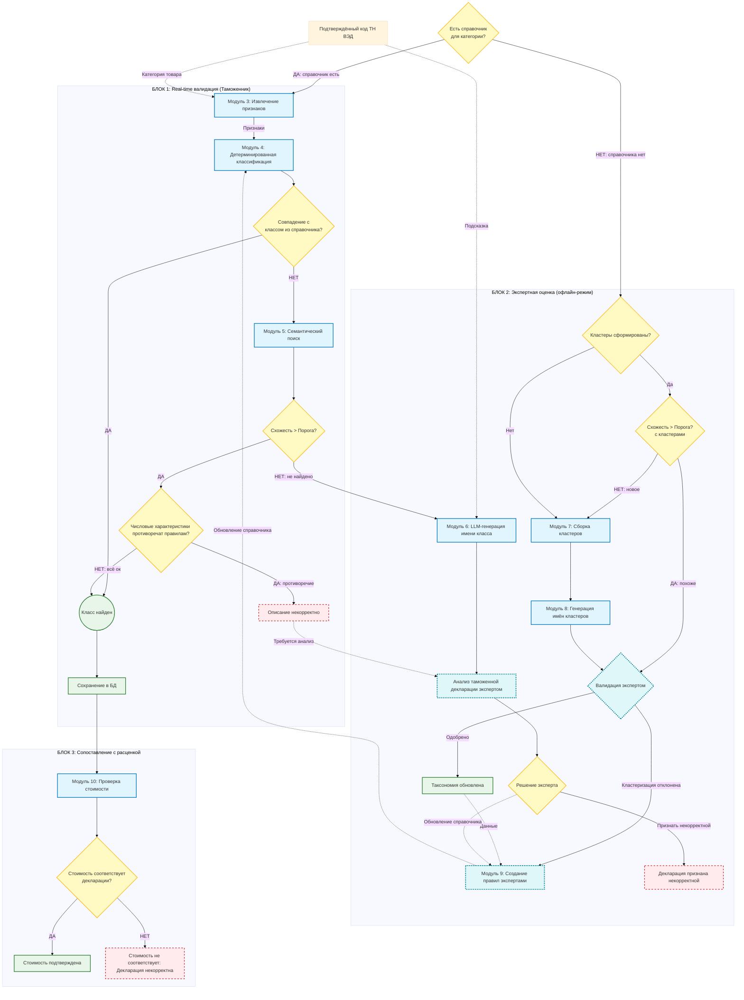
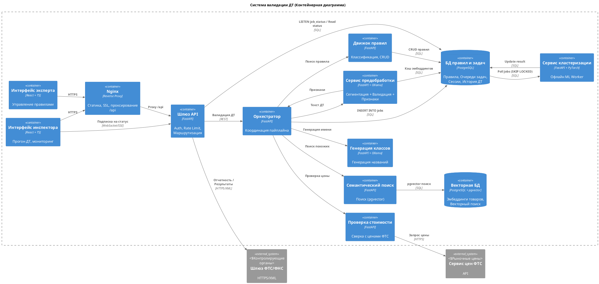

# Pipeline

Схема модулей и потоков обработки (Mermaid).



## Декомпозиция на микросервисы

Ниже — предлагаемое разбиение по **границам изменения, нагрузки и команды**: что выносить в отдельный деплой, а что оставить в одном процессе на раннем MVP.

| Модули схемы | Микросервис | Зачем отдельно |
|--------------|-------------|----------------|
| **М3** Извлечение признаков | `feature-extraction` | Свой жизненный цикл моделей/NLP, частые обновления без перезапуска правил. |
| **М4** Детерминированная классификация + **М9** Правила экспертов | `rule-engine` | DSL, версии справочников, компиляция правил; единый источник истины для «жёсткой» классификации. |
| **М5** Семантический поиск | `semantic-search` | Векторный индекс, иные ресурсы (GPU/память), смена эмбеддингов. |
| **М6**, **М8** (имена классов и кластеров) | `llm-service` | Вызовы внешнего LLM, таймауты, ключи, политика ретраев; общий контур для двух сценариев. |
| **М7** Сборка кластеров (+ оркестрация **М8**) | `taxonomy-clustering` | Пакетные job’ы, офлайн-режим, отдельно от real-time ветки. |
| Декларации, решения эксперта, очереди «на разбор» | `expert-workflow` | BFF/API для экспертного UI, статусы кейсов, связь с правилами и таксономией. |
| **М10** Проверка стоимости | `pricing-validation` | Интеграция с прайсами/тарифами, свой SLA и кэш. |
| Сквозной сценарий Блок 1 → 3 | `pipeline-orchestrator` | Один вход для таможни: порядок М3→М4→М5→М6→сохранение→М10. |
| UI | `frontend` | SPA + nginx. |

**Хранилища:** реляционная БД для правил/деклараций/аудита (PostgreSQL), векторный слой для семантического поиска (pgvector или Qdrant). Для офлайн-веток при росте нагрузки — брокер сообщений.

## Контекстная диаграмма

```plantuml
@startuml
!include https://raw.githubusercontent.com/plantuml-stdlib/C4-PlantUML/master/C4_Container.puml

title System Context: Automated Classification System

Person(customsOfficer, "Таможенник", "Проверяет декларации на границе")
Person_Ext(declarant, "Декларант", "Подает ДТ")
Person_Ext(expert, "Эксперт", "Настраивает правила классификации")

System(SystemAA, "Система классификации", "Автоматическая валидация ДТ")
System_Ext(SystemF, "Валидация цен", "Внешний сервис ФТС")
System_Ext(SystemC, "ФТС/ФНС", "Контролирующие органы")
SystemDb_Ext(SystemE, "Исторические ДТ", "Архив для аналитики")

Rel(declarant, customsOfficer, "Декларация")
Rel(customsOfficer, SystemAA, "Отправляет декларацию")
Rel(SystemAA, customsOfficer, "Статус валидации")
Rel(expert, SystemAA, "Настраивает правила")
Rel(SystemAA, expert, "Запрос на ручную валидацию")
Rel(SystemAA, SystemF, "Проверка цены")
Rel(SystemF, SystemC, "Отчёт по валидации")
Rel(SystemAA, SystemC, "Передача результатов")
Rel(SystemAA, SystemE, "Сохранение истории")
Rel(SystemC, declarant, "Проверка/штрафы", "пост-контроль")
@enduml
```

## Запуск MVP-контурa (test mode)

### 1) Сборка и старт

```powershell
docker compose build
docker compose up -d
docker compose ps
```

### 2) Ollama и модель

```powershell
docker compose exec ollama ollama pull llama3.1:8b
```

Если сервис не поднят:

```powershell
docker compose up -d ollama
```

### 3) Порты сервисов

- `8081` - `frontend-expert` (Expert UI, nginx)
- `8082` - `frontend-officer` (Officer UI, nginx)
- `8000` - `api-gateway`
- `8003` - `orchestrator`
- `8004` - `preprocessing`
- `8005` - `backend` (`rules-engine`)
- `8001` - `semantic-search`
- `8002` - `llm-naming` (`llm-generator`)
- `8006` - `price-validator`
- `8007` - `clustering-service`
- `11434` - `ollama`

### 4) Health/Ready проверки

```powershell
Invoke-RestMethod -Uri "http://localhost:8000/ready" | ConvertTo-Json -Depth 6
Invoke-RestMethod -Uri "http://localhost:8000/health"
Invoke-RestMethod -Uri "http://localhost:8003/health"
Invoke-RestMethod -Uri "http://localhost:8007/ready"
```

### 5) Smoke test сквозного пайплайна

```powershell
$body = @{
  declaration_id = "DT-TEST-001"
  description    = "Карбамид гранулированный 46% азота"
  tnved_code     = "3102101000"
} | ConvertTo-Json

Invoke-RestMethod -Uri "http://localhost:8000/api/validate" `
  -Method Post -ContentType "application/json" -Body $body | ConvertTo-Json -Depth 8
```

Проверка статуса фоновой job:

```powershell
Invoke-RestMethod -Uri "http://localhost:8000/api/jobs/1" | ConvertTo-Json -Depth 8
```

### 6) Остановка

```powershell
docker compose down
```

С удалением volume БД (полный сброс тестовых данных):

```powershell
docker compose down -v
```

## Развёртывание на сервере

### Требования к хосту

- Docker Engine + `docker compose`
- Ресурсы под PostgreSQL и Ollama (RAM/диск)

### Подготовка

Создайте `.env` рядом с `docker-compose.yml`:

```env
POSTGRES_PASSWORD=сложный_секрет
OLLAMA_MODEL=llama3.1:8b
# OLLAMA_BASE_URL=http://адрес:11434
```

Секреты не храните в Git.

### Базовый запуск

```powershell
docker compose build
docker compose up -d
docker compose ps
```

### Обновление

```powershell
git pull
docker compose build
docker compose up -d
```

### Минимальные проверки после деплоя

- `docker compose ps`
- `Invoke-RestMethod http://<host>:8000/ready`
- `docker compose exec ollama ollama list`

## Контейнерная диаграмма (MVP)


