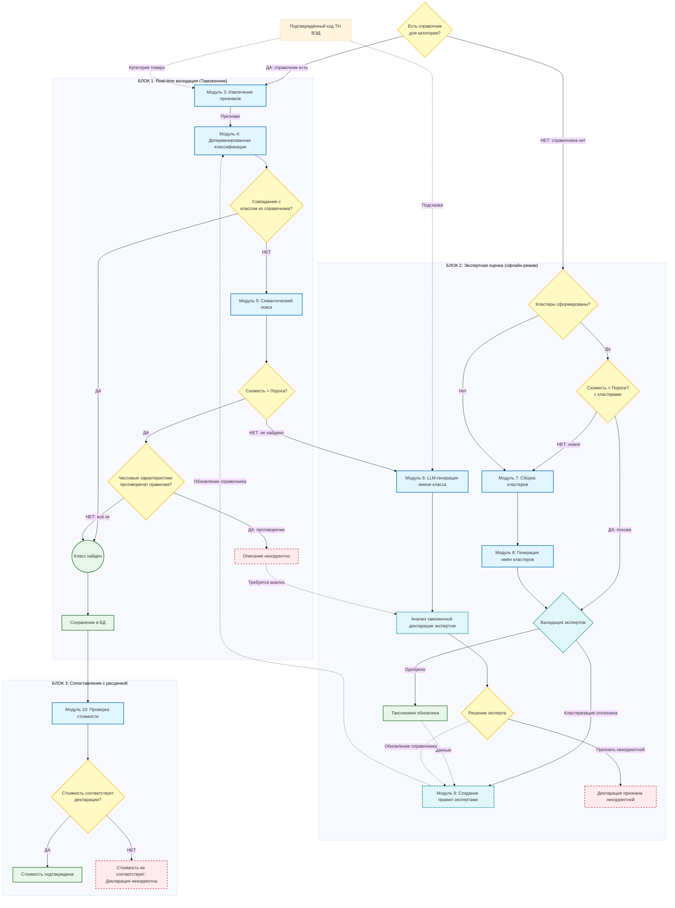

# Pipeline

**Автоматическая проверка и классификация таможенных деклараций** — извлечение признаков из описания товара, сопоставление со справочником правил, семантический поиск по эталонам, проверка стоимости и экспертный контур для спорных случаев.

> Рабочий прототип (MVP) для отладки архитектуры, бизнес-логики и интерфейсов ролей **инспектор** и **эксперт**. Часть внешних интеграций и фоновых сценариев реализована в упрощённом виде.

---

## Содержание

- [Возможности](#возможности)
- [Архитектура](#архитектура)
- [Структура репозитория](#структура-репозитория)
- [Стек](#стек)
- [Быстрый старт](#быстрый-старт)
- [Сервисы и порты](#сервисы-и-порты)
- [Конфигурация](#конфигурация)
- [Разработка](#разработка)
- [Документация](#документация)
- [Лицензия и статус](#лицензия-и-статус)

---

## Возможности

| Область | Что делает система |
|--------|---------------------|
| **Проверка ДТ** | Принимает данные декларации и прогоняет их по цепочке микросервисов |
| **Классификация** | Определяет класс товара по DSL-правилам справочника; при неоднозначности — по приоритету |
| **Семантика** | kNN по эмбеддингам эталонов: \(P(c) = V_{\mathrm{best}}(c) \cdot V_w(c) / (\varepsilon + \sum w_j)\) |
| **Контроль описания** | Выявляет противоречия в тексте и числовых характеристиках |
| **Экспертиза** | Передаёт спорные случаи в очередь эксперта; обновление правил и таксономии |
| **Стоимость** | Шаг сверки цены в общем пайплайне (в прототипе — упрощённая заглушка) |

Правила классификации в справочнике задаются в DSL (`backend/app/rules/`); сценарии покрыты тестами в [`backend/tests/test_classification.py`](backend/tests/test_classification.py).

---

## Архитектура

Два веб-интерфейса (эксперт и инспектор) обращаются к **API Gateway**, который координирует **оркестратор** проверки декларации. Оркестратор вызывает предобработку (LLM), движок правил, семантический поиск, именование классов и проверку цены. Состояние правил и настроек хранится в **PostgreSQL**.


```mermaid
flowchart TD
    %% Настройки оформления
    %%{init: {'theme': 'base', 'fontSize': '18px', 'layoutDirection': 'TD'}}%%

    %% Стилизация узлов
    classDef input fill:#f9f,stroke:#333,stroke-width:2px;
    classDef process fill:#e1f5fe,stroke:#0277bd,stroke-width:2px;
    classDef decision fill:#fff9c4,stroke:#fbc02d,stroke-width:2px;
    classDef output fill:#e8f5e9,stroke:#2e7d32,stroke-width:2px;
    classDef alert fill:#ffebee,stroke:#c62828,stroke-width:2px,stroke-dasharray: 5 5;
    classDef expert fill:#e0f7fa,stroke:#00838f,stroke-width:3px,stroke-dasharray: 3 3;

    %% Стилизация блоков
    classDef realtimeBlock fill:#f1f8e9,stroke:#1b5e20,stroke-width:3px,stroke-dasharray: none;
    classDef expertBlock fill:#fff3e0,stroke:#e65100,stroke-width:3px,stroke-dasharray: 5 3;
    classDef priceBlock fill:#e3f2fd,stroke:#0d47a1,stroke-width:3px,stroke-dasharray: none;

    %% Точка входа
    DictCheck{Есть справочник<br/>для категории?}:::decision
    VerifiedCode[Подтверждённый код ТН ВЭД]
    %% === БЛОК 1: Real-time для таможенника ===
    subgraph Block1 ["БЛОК 1: Real-time валидация (Таможенник)"]
        direction TB
        class Block1 realtimeBlock

        Mod3[Модуль 3: Извлечение признаков]:::process
        Mod4[Модуль 4: Детерминированная классификация]:::process
        RuleMatch{Совпадение с<br/>классом из справочника?}:::decision
        Mod5[Модуль 5: Семантический поиск]:::process
        SimCheck{Схожесть > Порога?}:::decision
        RuleMatch2{Числовые характеристики противоречат правилам?}:::decision
        Alert[Описание некорректно]:::alert
        ClassFound((Класс найден)):::output
        SaveDB[Сохранение в БД]:::output
    end

    %% === БЛОК 2: Экспертная обработка (офлайн) ===
    subgraph Block2 ["БЛОК 2: Экспертная оценка (офлайн-режим)"]
        direction TB
        class Block2 expertBlock

        RulesCreation[Модуль 9: Создание правил экспертами]:::expert
        Mod6[Модуль 6: LLM-генерация имени класса]:::process
        CheckClusters{Кластеры сформированы?}:::decision
        SemClusterCheck{Схожесть > Порога?<br/>с кластерами}:::decision
        Mod7[Модуль 7: Сборка кластеров]:::process
        Mod8[Модуль 8: Генерация имён кластеров]:::process
        ExpertValidateGen{Валидация экспертом}:::expert
        TaxonomySaved[Таксономия обновлена]:::output
        DeclAnalysis[Анализ таможенной декларации экспертом]:::expert
        DeclDecision{Решение эксперта}:::decision
        DeclInvalid[Декларация признана некорректной]:::alert
    end

    %% === БЛОК 3: Проверка стоимости ===
    subgraph Block3 ["БЛОК 3: Сопоставление с расценкой"]
        direction TB
        class Block3 priceBlock

        PriceCheck[Модуль 10: Проверка стоимости]:::process
        PriceMatch{Стоимость соответствует<br/>декларации?}:::decision
        PriceOK[Стоимость подтверждена]:::output
        PriceMismatch[Стоимость не соответствует: Декларация некорректна]:::alert
    end

    %% === Логика маршрутизации ===
    DictCheck -->|ДА: справочник есть| Mod3
    DictCheck -->|НЕТ: справочника нет| CheckClusters
    Mod3 --> |Признаки | Mod4
    Mod4 --> RuleMatch
    RuleMatch -- ДА --> ClassFound
    RuleMatch -- НЕТ --> Mod5
    Mod5 --> SimCheck
    SimCheck -- ДА --> RuleMatch2
    RuleMatch2 -- ДА: противоречие --> Alert
    RuleMatch2 -- НЕТ: всё ок --> ClassFound
    SimCheck -- НЕТ: не найдено --> Mod6
    Alert -.->|Требуется анализ| DeclAnalysis
    Mod6 --> DeclAnalysis
    VerifiedCode -.->|Подсказка | Mod6
    VerifiedCode -.-> |Категория товара| Mod3
    CheckClusters -- Да --> SemClusterCheck
    SemClusterCheck -- ДА: похоже --> ExpertValidateGen
    SemClusterCheck -- НЕТ: новое --> Mod7
    CheckClusters -- Нет --> Mod7
    Mod7 --> Mod8
    Mod8 --> ExpertValidateGen
    ExpertValidateGen -- Одобрено --> TaxonomySaved
    ExpertValidateGen -- Кластеризация отклонена --> RulesCreation
    TaxonomySaved -.->|Данные| RulesCreation
    RulesCreation -.->|Обновление справочника| Mod4
    DeclAnalysis --> DeclDecision
    DeclDecision -.->|Обновление справочника| RulesCreation
    DeclDecision -- Признать некорректной --> DeclInvalid
    ClassFound --> SaveDB
    SaveDB --> PriceCheck
    PriceCheck --> PriceMatch
    PriceMatch -- ДА --> PriceOK
    PriceMatch -- НЕТ --> PriceMismatch
```

### Сервисы в Docker Compose

| Сервис | Контейнер | Роль |
|--------|-----------|------|
| `postgres` | `pipeline_postgres` | Правила, настройки, очередь кластеризации |
| `ollama` | `pipeline_ollama` | Локальные LLM для предобработки и именования |
| `backend` | `pipeline_rules_engine` | CRUD справочника, классификация по DSL |
| `semantic-search` | `pipeline_semantic_search` | kNN по эмбеддингам (`sentence-transformers`) |
| `llm-naming` | `pipeline_llm_naming` | Предложение имени класса (Ollama / vLLM) |
| `preprocessing` | `pipeline_preprocessing` | Извлечение признаков из текста ДТ |
| `price-validator` | `pipeline_price_validator` | Шаг проверки стоимости |
| `clustering-service` | `pipeline_clustering_service` | Кластеризация эталонов (k-means) |
| `orchestrator` | `pipeline_orchestrator` | Сценарий проверки декларации |
| `api-gateway` | `pipeline_api_gateway` | Единая точка входа для UI |
| `frontend-expert` | `pipeline_frontend_expert` | UI эксперта (nginx + React) |
| `frontend-officer` | `pipeline_frontend_officer` | UI инспектора (nginx + React) |

Конфигурация пайплайна: [`services/api-gateway/config/pipeline.json`](services/api-gateway/config/pipeline.json) (тот же файл смонтирован в оркестратор).

**Тома:** `pgdata` — база; `ollama_data` — модели. Порт Postgres **5432** проброшен на хост для локальной разработки backend без Docker.

**GPU:** `ollama` и `clustering-service` в `docker-compose.yml` запускаются с `gpus: all`, поэтому нужны NVIDIA-драйвер и NVIDIA Container Toolkit.

---

## Структура репозитория

Ниже — карта каталогов и ключевых файлов: что за что отвечает и куда смотреть при доработке. Вложенные `__pycache__`, `node_modules`, `dist`, тома Docker и локальные кэши в описании не перечислены.

### Корень проекта

| Путь | Назначение |
|------|------------|
| [`docker-compose.yml`](docker-compose.yml) | Сборка и запуск всех контейнеров: Postgres, Ollama, микросервисы, два frontend, сети и тома `pgdata` / `ollama_data`. |
| [`requirements.txt`](requirements.txt) | Зависимости для ноутбука и вспомогательных скриптов вне Docker-образов сервисов. |
| [`.dockerignore`](.dockerignore) | Исключения при `docker build` (ускорение контекста сборки). |
| [`numeric_feature_extraction_validation.ipynb`](numeric_feature_extraction_validation.ipynb) | Исследовательская проверка извлечения числовых признаков (не входит в runtime пайплайна). |
| [`archive/`](archive/) | Устаревшие или вынесенные артефакты; на работу compose не влияет. |

### [`config/`](config/)

| Файл | Назначение |
|------|------------|
| [`llm_models.json`](config/llm_models.json) | Эталонный список моделей и параметров генерации для извлечения признаков; монтируется в backend и preprocessing, дублируется в БД после правок в UI. |

### [`data/`](data/) и [`scripts/`](scripts/)

| Путь | Назначение |
|------|------------|
| `data/` | Локальные входные данные (например, Excel «ТН ВЭД»); в git обычно только `.gitkeep`. |
| [`scripts/build_tn_ved_tree_from_xlsx.py`](scripts/build_tn_ved_tree_from_xlsx.py) | Генерация дерева кодов ТН ВЭД для frontend (`tnVedChildren.generated.ts`). |

### [`shared/`](shared/) — общий Python-код

Копируется в образы backend и микросервисов; единые контракты для LLM и разбора JSON.

| Файл / каталог | Назначение |
|----------------|------------|
| [`extraction_prompt.py`](shared/extraction_prompt.py) | Тексты и сборка промпта извлечения признаков из описания декларации. |
| [`json_recovery.py`](shared/json_recovery.py) | Восстановление «битого» JSON из ответа модели (обрезки, лишние запятые). |
| [`llm_runtime/`](shared/llm_runtime/) | Абстракция вызова LLM: `config.py` — настройки, `ollama_backend.py` / `vllm_backend.py` — транспорт, `compat.py` — совместимость API. |

### [`backend/`](backend/) — движок правил (FastAPI)

Контейнер `pipeline_rules_engine`, порт **8005**. Хранит справочники в PostgreSQL, компилирует DSL, классифицирует декларации, отдаёт API эксперту и оркестратору.

| Путь | Назначение |
|------|------------|
| [`Dockerfile`](backend/Dockerfile) | Образ: зависимости, `app/`, `shared/extraction_prompt.py`, `config/llm_models.json`. |
| [`requirements.docker.txt`](backend/requirements.docker.txt) | Python-зависимости образа. |
| [`pytest.ini`](backend/pytest.ini) | Настройки `pytest` для `backend/tests/`. |

#### `backend/app/` — приложение

| Путь | Назначение |
|------|------------|
| [`main.py`](backend/app/main.py) | Точка входа Uvicorn: создание FastAPI-приложения, healthcheck. |
| [`composition.py`](backend/app/composition.py) | Сборка зависимостей (репозитории, use case) для маршрутов. |
| [`primary_catalog_settings.py`](backend/app/primary_catalog_settings.py) | Настройки «основного» справочника для UI и API. |

**`app/api/`** — HTTP-маршруты (тонкий слой):

| Файл | Назначение |
|------|------------|
| [`routes_rules.py`](backend/app/api/routes_rules.py) | CRUD справочника, валидация DSL, логические пересечения правил, семантические пороги. |
| [`routes_officer_pipeline.py`](backend/app/api/routes_officer_pipeline.py) | Контур инспектора: прогон декларации по справочнику. |
| [`routes_expert_decisions.py`](backend/app/api/routes_expert_decisions.py) | Очередь экспертизы, решения по классам и именованию. |
| [`routes_feature_extraction_settings.py`](backend/app/api/routes_feature_extraction_settings.py) | Настройки моделей и промптов извлечения признаков. |

**`app/application/`** — сценарии и доменная логика без HTTP:

| Каталог | Назначение |
|---------|------------|
| [`use_cases/`](backend/app/application/use_cases/) | Сценарии: `rules_catalog.py`, `officer_pipeline.py`, `expert_decisions*.py`, настройки извлечения. |
| [`services/`](backend/app/application/services/) | Сервисы: `classification_conflicts.py` (пересечения правил), `rule_list.py`, `reference_embeddings.py`, метаданные DSL. |
| [`dto/`](backend/app/application/dto/) | DTO для ответов API (конфликты, списки правил). |
| [`ports/`](backend/app/application/ports/) | Интерфейсы репозиториев и внешних сервисов. |

**`app/infrastructure/`** — реализации портов:

| Путь | Назначение |
|------|------------|
| [`repositories/sqlalchemy_*.py`](backend/app/infrastructure/repositories/) | Доступ к PostgreSQL: справочник, решения эксперта, настройки. |
| [`http/semantic_search_client.py`](backend/app/infrastructure/http/semantic_search_client.py) | HTTP-клиент к сервису семантического поиска. |

**`app/db/`** — ORM:

| Файл | Назначение |
|------|------------|
| [`models.py`](backend/app/db/models.py) | Таблицы: версии справочника, правила, эталоны, настройки, очереди. |
| [`session.py`](backend/app/db/session.py) | Сессия SQLAlchemy, `DATABASE_URL` по умолчанию. |

**`app/pipeline/`** — валидация officer-контура:

| Файл | Назначение |
|------|------------|
| [`validator.py`](backend/app/pipeline/validator.py) | Сводная проверка результата пайплайна инспектора (правила + семантика). |

**`app/rules/`** — исполнение DSL справочника (без БД и HTTP):

```
rules/
├── dsl_models.py          # Pydantic-модели DSL: схема признаков, условия, правила классов
├── compiler.py            # Компиляция dsl_json → динамическая Pydantic-схема + validate()
├── cross_rules.py         # Межполевые ограничения (суммы, обязательность)
├── schema_normalize.py    # lower() для строк enum перед валидацией
├── officer_validation_errors_ru.py  # Тексты ошибок для UI инспектора
├── primitives/            # Низкоуровневые примитивы
│   ├── path_utils.py      # Пути JSON: prop, array[*]
│   ├── numeric_cell.py    # Число или интервал [min, max] в ячейке показателя
│   └── formula_safe_eval.py  # Безопасный eval формул (+ − × ÷)
├── classification/        # Рантайм классификации
│   ├── predicates.py      # Матчинг условий, RuleMatcher, first_match
│   ├── messages_ru.py     # Русские формулировки невыполненных условий
│   ├── engine.py          # evaluate_classification, semantic_check
│   └── errors.py          # ClassificationError
└── analysis/
    └── overlap.py         # Логические пересечения между правилами (экран эксперта)
```

Файлы `path_utils.py`, `numeric_cell.py`, `formula_safe_eval.py`, `rule_overlap.py` в корне `rules/` — тонкие прокси для старых импортов; новый код лучше подключать из `primitives/`, `classification/`, `analysis/`.

**`app/examples/`** — демо DSL (например, удобрения) для тестов и документации.

**`backend/tests/`** — автотесты движка правил:

| Файл | Что проверяет |
|------|----------------|
| `test_classification.py` | Классификация: приоритеты, показатели, формулы, описание. |
| `test_rules_overlap.py` | Пересечения правил и сервис конфликтов. |
| `test_schema_normalize.py` | Нормализация enum-строк. |
| `test_pipeline_validator.py` | Валидатор officer-пайплайна. |
| `test_expert_decisions_*.py` | Создание и починка очереди экспертизы. |

### [`services/`](services/) — микросервисы пайплайна

Общий [`requirements.base.txt`](services/requirements.base.txt) подключается в Dockerfile отдельных сервисов. Каждый каталог: `Dockerfile`, `requirements.txt`, `app/main.py`.

| Сервис | Ключевые файлы | Назначение |
|--------|----------------|------------|
| [**api-gateway**](services/api-gateway/) | `app/main.py`, [`config/pipeline.json`](services/api-gateway/config/pipeline.json) | Единая точка `/api` для UI: прокси к оркестратору и backend, `/ready`, `/health`. |
| | `app/pipeline_config.py` | Загрузка шагов пайплайна из JSON. |
| | `app/semantic_cleaning.py`, `few_shot_uncertainty.py` | Очистка текста и эвристики неопределённости. |
| | [`config/prompt_generator.json`](services/api-gateway/config/prompt_generator.json) | Настройки генератора промптов. |
| [**orchestrator**](services/orchestrator/) | `app/main.py` | Сценарий проверки декларации: preprocessing → rules → semantic → naming → price. |
| | `app/pipeline_config.py`, `semantic_cleaning.py` | Те же контракты, что у gateway (файл pipeline смонтирован из gateway). |
| | `tests/` | Тесты потока validate и очистки текста. |
| [**preprocessing**](services/preprocessing/) | `app/main.py`, `llm_runtime_bridge.py` | Извлечение признаков из текста ДТ через LLM. |
| [**semantic-search**](services/semantic-search/) | `app/main.py` | kNN по эмбеддингам эталонов (`sentence-transformers`). |
| [**llm-naming**](services/llm-naming/) | `app/main.py`, `config/class_naming_prompt.txt` | Предложение имени класса по эталонам. |
| [**clustering-service**](services/clustering-service/) | `app/main.py` | Кластеризация эталонов (k-means) для таксономии эксперта. |
| [**price-validator**](services/price-validator/) | `app/main.py` | Шаг сверки стоимости (в MVP — упрощённая логика). |

### [`frontend/`](frontend/) — React (Vite + TypeScript)

Два образа из одного кода: **эксперт** (`VITE_UI_MODE=expert`, порт 8081) и **инспектор** (`officer`, 8082). Статика отдаётся nginx ([`nginx.conf`](frontend/nginx.conf)).

| Путь | Назначение |
|------|------------|
| [`src/main.tsx`](frontend/src/main.tsx), [`App.tsx`](frontend/src/App.tsx) | Точка входа, маршруты expert/officer. |
| [`src/api/client.ts`](frontend/src/api/client.ts) | Все вызовы API Gateway (`VITE_API_BASE`). |
| [`src/pages/`](frontend/src/pages/) | Экраны: мастер справочника, валидация инспектора, очередь решений, архив, настройки. |
| [`src/ui/`](frontend/src/ui/) | Переиспользуемые блоки: редактор признаков, ТН ВЭД, правила классификации, импорт датасета. |
| [`src/expert/`](frontend/src/expert/) | Логика эксперта: черновик справочника, kNN-отображение, очередь решений, числовые характеристики. |
| [`src/catalog/`](frontend/src/catalog/) | Деревья и справочники кодов ТН ВЭД (в т.ч. `tnVedChildren.generated.ts`). |
| [`src/rjsf/`](frontend/src/rjsf/) | JSON Schema Form для редактирования DSL и метасхемы. |
| [`src/utils/`](frontend/src/utils/) | JSON recovery, парсинг таблиц, форматирование колонок классов. |
| [`package.json`](frontend/package.json), [`vite.config.ts`](frontend/vite.config.ts) | Сборка и dev-сервер. |

### [`docs/`](docs/) — проектная документация

| Путь | Назначение |
|------|------------|
| [`architecture/backend-oop-transition.md`](docs/architecture/backend-oop-transition.md) | Описание слоёв application / infrastructure в backend. |
| [`architecture/class-diagrams/backend/`](docs/architecture/class-diagrams/backend/) | PlantUML: пакеты и классы API, rules, db, pipeline. |

Подробные правила DSL в интерфейсе эксперта описаны в UI и в тестах `backend/tests/test_classification.py`; отдельный `docs/README-klassifikaciya-spravochnika.md` при необходимости добавляется в репозиторий отдельно.

### Поток данных (кратко)

1. **Инспектор** → Gateway `/api/validate` → Orchestrator → Preprocessing (LLM) → Backend (классификация по DSL) → Semantic-search → при необходимости LLM-naming → Price-validator.  
2. **Эксперт** → Gateway → Backend: правки `dsl_json`, проверка пересечений, эталоны, настройки моделей; Clustering-service — офлайн-кластеры.  
3. **Состояние** — PostgreSQL (`backend/app/db/models.py`); **модели LLM** — Ollama (том `ollama_data`) или vLLM по `LLM_BACKEND`.

---

## Стек

| Слой | Технологии |
|------|------------|
| **API** | Python 3, FastAPI, Uvicorn, Pydantic v2 |
| **Данные** | PostgreSQL 16, SQLAlchemy 2 (backend), psycopg2 |
| **ML / NLP** | Ollama / vLLM (`shared/llm_runtime`), sentence-transformers, scikit-learn |
| **Frontend** | React, TypeScript, Vite → статика за nginx |
| **Инфра** | Docker Compose |

---

## Быстрый старт

### Требования

- [Docker Engine](https://docs.docker.com/engine/install/) и Docker Compose v2
- ~8+ ГБ RAM (PostgreSQL + Ollama + эмбеддинги)
- Для GPU: NVIDIA-драйвер и [Container Toolkit](https://docs.nvidia.com/datacenter/cloud-native/container-toolkit/install-guide.html)

### 1. Клонирование и переменные

```bash
git clone <URL_репозитория>
cd Pipeline
```

Создайте `.env` рядом с `docker-compose.yml` (в git не коммитится):

```env
POSTGRES_PASSWORD=сложный_секрет
OLLAMA_MODEL=llama3.1:8b
# LLM_BACKEND=ollama
# VITE_API_BASE=http://<хост>:8000/api   # при доступе не с localhost
```

### 2. Сборка и запуск

```bash
docker compose build
docker compose up -d
docker compose ps
```

### 3. Модель Ollama

```bash
docker compose exec ollama ollama pull llama3.1:8b
docker compose exec ollama ollama list
```

### 4. Интерфейсы

| URL | Назначение |
|-----|------------|
| http://localhost:8081 | Эксперт — правила, модели, очередь решений |
| http://localhost:8082 | Инспектор — прогон декларации |
| http://localhost:8000 | API Gateway (`/api`, `/ready`, `/health`) |

### 5. Проверка

```powershell
# Windows PowerShell
Invoke-RestMethod -Uri "http://localhost:8000/ready" | ConvertTo-Json -Depth 6
Invoke-RestMethod -Uri "http://localhost:8000/health"

$body = @{
  declaration_id = "DT-TEST-001"
  description    = "Карбамид гранулированный 46% азота"
  tnved_code     = "3102101000"
} | ConvertTo-Json

Invoke-RestMethod -Uri "http://localhost:8000/api/validate" `
  -Method Post -ContentType "application/json" -Body $body | ConvertTo-Json -Depth 8
```

```bash
# Linux / macOS
curl -s http://localhost:8000/ready | jq .
curl -s -X POST http://localhost:8000/api/validate \
  -H 'Content-Type: application/json' \
  -d '{"declaration_id":"DT-TEST-001","description":"Карбамид гранулированный 46% азота","tnved_code":"3102101000"}' | jq .
```

### Остановка

```bash
docker compose down
```

### Обновление на сервере

```bash
git pull
docker compose build
docker compose up -d
docker compose ps
curl -s http://localhost:8000/ready
```

---

## Сервисы и порты

| Порт | Сервис |
|------|--------|
| 8081 | `frontend-expert` |
| 8082 | `frontend-officer` |
| 8000 | `api-gateway` |
| 8003 | `orchestrator` |
| 8004 | `preprocessing` |
| 8005 | `backend` (движок правил) |
| 8001 | `semantic-search` |
| 8002 | `llm-naming` |
| 8006 | `price-validator` |
| 8007 | `clustering-service` |
| 5432 | `postgres` |
| 11434 | `ollama` |

---

## Конфигурация

### Модели извлечения признаков

Файл [`config/llm_models.json`](config/llm_models.json) — список моделей и параметры генерации. Его читают backend и `preprocessing` (путь в контейнере: `FEATURE_EXTRACTION_MODEL_DEFAULTS_PATH` / `MODEL_RUNTIME_SETTINGS_PATH`).

После первого сохранения через UI настройки дублируются в PostgreSQL; файл в репозитории остаётся эталоном для новых стендов.

### Семантический fallback

Пороги τ₁, τ₂, пол \(s_0\), γ и промпт чистки текста — в UI эксперта (настройки семантики) и через API backend. Формула поддержки класса реализована в [`services/semantic-search/app/main.py`](services/semantic-search/app/main.py).

### Справочник ТН ВЭД

Дерево кодов для UI: `frontend/src/catalog/tnVedChildren.generated.ts`.

```bash
# положите data/ТН ВЭД.xlsx, затем из корня репозитория:
python scripts/build_tn_ved_tree_from_xlsx.py --help
```

### Переменные окружения (выборочно)

| Переменная | Где | Смысл |
|------------|-----|--------|
| `DATABASE_URL` | backend | PostgreSQL (`postgresql+psycopg2://…`) |
| `LLM_BACKEND` | preprocessing, llm-naming | `ollama` (по умолчанию) или `vllm` |
| `OLLAMA_BASE_URL` | preprocessing, llm-naming | URL Ollama |
| `SEMANTIC_SEARCH_EMBEDDING_MODEL` | semantic-search | Модель эмбеддингов |
| `SEMANTIC_SEARCH_FORCE_STUB` | semantic-search | `1` — заглушка без модели |
| `VITE_API_BASE` | сборка frontend | Базовый URL API для браузера |

---

## Разработка

### Backend локально

```bash
docker compose up -d postgres
cd backend
pip install -r requirements.docker.txt
uvicorn app.main:app --reload --host 0.0.0.0 --port 8000
```

`DATABASE_URL` по умолчанию — в [`backend/app/db/session.py`](backend/app/db/session.py).

### Frontend локально

```bash
cd frontend
npm install
npm run dev        # разработка
npm test           # vitest
npm run build      # production-бандл
```

Режим UI задаётся `VITE_UI_MODE=expert|officer` (в Docker — build-args в compose).

### Тесты

```bash
cd backend && pytest
cd frontend && npm test
cd services/orchestrator && pytest
```

---

## Документация

| Документ | Описание |
|----------|----------|
| [Структура репозитория](#структура-репозитория) (этот README) | Карта каталогов и назначение файлов |
| [`docs/architecture/backend-oop-transition.md`](docs/architecture/backend-oop-transition.md) | Переход backend на слои application / infrastructure |
| [`docs/architecture/class-diagrams/`](docs/architecture/class-diagrams/) | PlantUML-диаграммы классов (для разработчиков) |
| [`backend/tests/test_classification.py`](backend/tests/test_classification.py) | Примеры поведения DSL-классификации |
| [`docker-compose.yml`](docker-compose.yml) | Источник правды по сервисам и томам |

---

