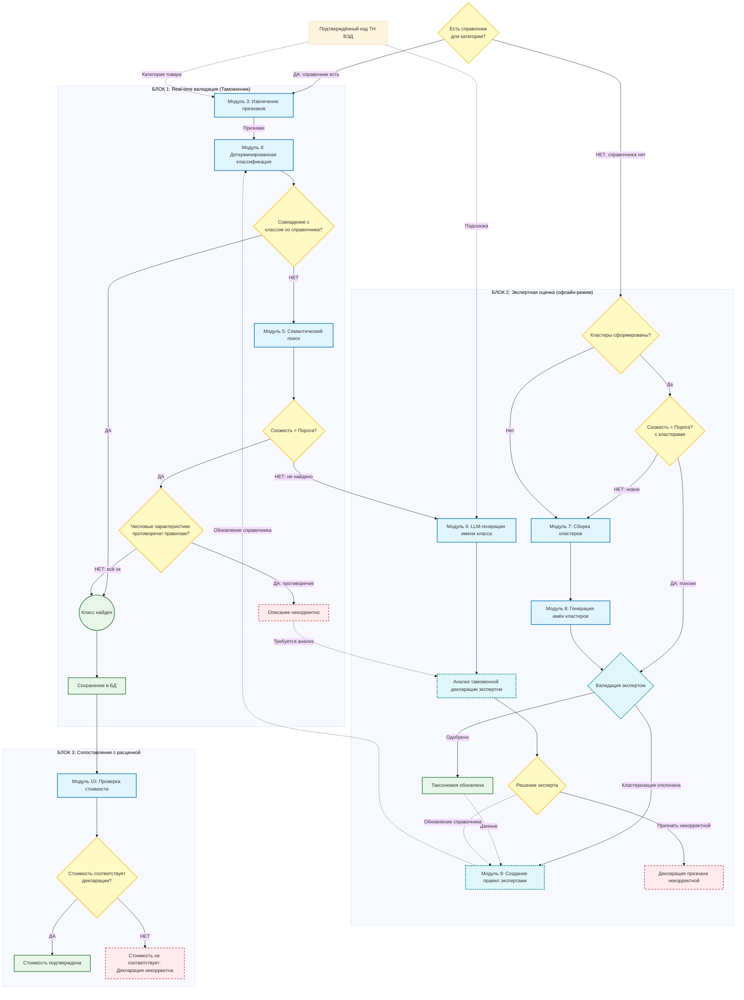

# Pipeline

Репозиторий системы автоматической проверки и классификации деклараций.

## Зачем нужна эта система

Система снижает долю ручной проверки деклараций и помогает инспектору быстрее принимать решение по спорным позициям.  
Она собирает в один процесс извлечение признаков из описания товара, сопоставление с правилами, смысловой поиск похожих примеров и проверку стоимости.

## Что делает система

- Принимает данные декларации и запускает проверку по цепочке сервисов.
- Пытается определить корректный класс товара по правилам и похожим примерам.
- Выявляет противоречия в описании и числовых характеристиках.
- Передаёт спорные случаи в экспертный контур для уточнения правил.
- Возвращает итог: проверка пройдена или требуется дополнительная проверка.

## Статус проекта

Это рабочий прототип (MVP) для отладки архитектуры, бизнес-логики и интерфейсов ролей «эксперт» и «инспектор».  
Часть интеграций с внешними источниками и отдельные фоновые сценарии пока реализованы в упрощённом виде.

## Технологии

- **Сервисы и API:** Python, FastAPI, Uvicorn.
- **Хранение данных:** PostgreSQL.
- **ML и смысловой поиск:** `sentence-transformers`, `scikit-learn`.
- **Работа с LLM:** Ollama (и поддержка vLLM в конфигурации).
- **Интерфейсы:** React + TypeScript + Vite, nginx.
- **Инфраструктура запуска:** Docker Compose.

Ниже — общая схема модулей и потоков обработки.


```mermaid
flowchart TD
    %% Настройки оформления
    %%{init: {'theme': 'base', 'fontSize': '18px', 'layoutDirection': 'TD'}}%%

    %% Стилизация узлов
    classDef input fill:#f9f,stroke:#333,stroke-width:2px;
    classDef process fill:#e1f5fe,stroke:#0277bd,stroke-width:2px;
    classDef decision fill:#fff9c4,stroke:#fbc02d,stroke-width:2px;
    classDef output fill:#e8f5e9,stroke:#2e7d32,stroke-width:2px;
    classDef alert fill:#ffebee,stroke:#c62828,stroke-width:2px,stroke-dasharray: 5 5;
    classDef expert fill:#e0f7fa,stroke:#00838f,stroke-width:3px,stroke-dasharray: 3 3;

    %% Стилизация блоков
    classDef realtimeBlock fill:#f1f8e9,stroke:#1b5e20,stroke-width:3px,stroke-dasharray: none;
    classDef expertBlock fill:#fff3e0,stroke:#e65100,stroke-width:3px,stroke-dasharray: 5 3;
    classDef priceBlock fill:#e3f2fd,stroke:#0d47a1,stroke-width:3px,stroke-dasharray: none;

    %% Точка входа
    DictCheck{Есть справочник<br/>для категории?}:::decision
    VerifiedCode[Подтверждённый код ТН ВЭД]
    %% === БЛОК 1: Real-time для таможенника ===
    subgraph Block1 ["БЛОК 1: Real-time валидация (Таможенник)"]
        direction TB
        class Block1 realtimeBlock

        Mod3[Модуль 3: Извлечение признаков]:::process
        Mod4[Модуль 4: Детерминированная классификация]:::process
        RuleMatch{Совпадение с<br/>классом из справочника?}:::decision
        Mod5[Модуль 5: Семантический поиск]:::process
        SimCheck{Схожесть > Порога?}:::decision
        RuleMatch2{Числовые характеристики противоречат правилам?}:::decision
        Alert[Описание некорректно]:::alert
        ClassFound((Класс найден)):::output
        SaveDB[Сохранение в БД]:::output
    end

    %% === БЛОК 2: Экспертная обработка (офлайн) ===
    subgraph Block2 ["БЛОК 2: Экспертная оценка (офлайн-режим)"]
        direction TB
        class Block2 expertBlock

        RulesCreation[Модуль 9: Создание правил экспертами]:::expert
        Mod6[Модуль 6: LLM-генерация имени класса]:::process
        CheckClusters{Кластеры сформированы?}:::decision
        SemClusterCheck{Схожесть > Порога?<br/>с кластерами}:::decision
        Mod7[Модуль 7: Сборка кластеров]:::process
        Mod8[Модуль 8: Генерация имён кластеров]:::process
        ExpertValidateGen{Валидация экспертом}:::expert
        TaxonomySaved[Таксономия обновлена]:::output
        DeclAnalysis[Анализ таможенной декларации экспертом]:::expert
        DeclDecision{Решение эксперта}:::decision
        DeclInvalid[Декларация признана некорректной]:::alert
    end

    %% === БЛОК 3: Проверка стоимости ===
    subgraph Block3 ["БЛОК 3: Сопоставление с расценкой"]
        direction TB
        class Block3 priceBlock

        PriceCheck[Модуль 10: Проверка стоимости]:::process
        PriceMatch{Стоимость соответствует<br/>декларации?}:::decision
        PriceOK[Стоимость подтверждена]:::output
        PriceMismatch[Стоимость не соответствует: Декларация некорректна]:::alert
    end

    %% === Логика маршрутизации ===
    DictCheck -->|ДА: справочник есть| Mod3
    DictCheck -->|НЕТ: справочника нет| CheckClusters
    Mod3 --> |Признаки | Mod4
    Mod4 --> RuleMatch
    RuleMatch -- ДА --> ClassFound
    RuleMatch -- НЕТ --> Mod5
    Mod5 --> SimCheck
    SimCheck -- ДА --> RuleMatch2
    RuleMatch2 -- ДА: противоречие --> Alert
    RuleMatch2 -- НЕТ: всё ок --> ClassFound
    SimCheck -- НЕТ: не найдено --> Mod6
    Alert -.->|Требуется анализ| DeclAnalysis
    Mod6 --> DeclAnalysis
    VerifiedCode -.->|Подсказка | Mod6
    VerifiedCode -.-> |Категория товара| Mod3
    CheckClusters -- Да --> SemClusterCheck
    SemClusterCheck -- ДА: похоже --> ExpertValidateGen
    SemClusterCheck -- НЕТ: новое --> Mod7
    CheckClusters -- Нет --> Mod7
    Mod7 --> Mod8
    Mod8 --> ExpertValidateGen
    ExpertValidateGen -- Одобрено --> TaxonomySaved
    ExpertValidateGen -- Кластеризация отклонена --> RulesCreation
    TaxonomySaved -.->|Данные| RulesCreation
    RulesCreation -.->|Обновление справочника| Mod4
    DeclAnalysis --> DeclDecision
    DeclDecision -.->|Обновление справочника| RulesCreation
    DeclDecision -- Признать некорректной --> DeclInvalid
    ClassFound --> SaveDB
    SaveDB --> PriceCheck
    PriceCheck --> PriceMatch
    PriceMatch -- ДА --> PriceOK
    PriceMatch -- НЕТ --> PriceMismatch
```

## Состав системы в Docker Compose

Ниже перечислены сервисы из корневого файла [`docker-compose.yml`](docker-compose.yml) в том же порядке. Имена контейнеров удобно сверять командой `docker compose ps`.

| Сервис | Контейнер | Назначение |
|---|---|---|
| `postgres` | `pipeline_postgres` | PostgreSQL 16: правила, настройки приложения, очередь заданий для кластеризации. |
| `ollama` | `pipeline_ollama` | Запуск и хранение языковых моделей; к нему обращаются предобработка и сервис имён классов. |
| `backend` | `pipeline_rules_engine` | Правила, классификация, настройки извлечения признаков, сценарии работы инспектора. |
| `semantic-search` | `pipeline_semantic_search` | Поиск похожих записей по смыслу: векторы через `sentence-transformers`, сравнение с эталонами в памяти процесса. |
| `llm-naming` | `pipeline_llm_naming` | Подбор названия класса через Ollama или vLLM (`LLM_BACKEND` в compose); текст промпта подключается томом из репозитория. |
| `preprocessing` | `pipeline_preprocessing` | Извлечение признаков из текста, управление моделями; для операций с контейнером Ollama смонтирован сокет Docker на хосте. |
| `price-validator` | `pipeline_price_validator` | Шаг проверки стоимости в общей цепочке. Сейчас использует условную оценку без обращения во внешние системы (ответ помечается как заглушка). |
| `clustering-service` | `pipeline_clustering_service` | Отбор кандидатов в группы (k-means по векторам) работает через HTTP; фоновая обработка очереди и часть отдельных сценариев пока упрощены. |
| `orchestrator` | `pipeline_orchestrator` | Собирает шаги проверки декларации в единый сценарий. Часть числовых параметров задаётся в [`services/api-gateway/config/pipeline.json`](services/api-gateway/config/pipeline.json), этот же файл подключён и в шлюз. |
| `api-gateway` | `pipeline_api_gateway` | Точка входа для веб-интерфейсов: проверка запросов, контроль готовности, маршрутизация к остальным сервисам и вспомогательные сценарии (в том числе few-shot). Настройки генератора текста — в `prompt_generator.json`. |
| `frontend-expert` | `pipeline_frontend_expert` | Статика интерфейса эксперта (режим сборки `expert`), nginx. |
| `frontend-officer` | `pipeline_frontend_officer` | Статика интерфейса инспектора (режим `officer`), nginx. |

**Данные и файлы на машине:** том `pgdata` хранит базу, `ollama_data` — загруженные модели. В контейнеры подключаются `config/llm_models.json`, `services/api-gateway/config/pipeline.json` (также в оркестратор) и `prompt_generator.json` для шлюза. Отдельной векторной базы в составе нет: сервис смыслового поиска считает векторы самостоятельно.

**Использование GPU для кластеризации:** при необходимости можно подключить файл [`docker-compose.clustering-gpu.yml`](docker-compose.clustering-gpu.yml) поверх основного. В файле есть пример команды; на хосте должны быть установлены драйверы NVIDIA и Container Toolkit.

## Настройки моделей для извлечения признаков

Единый файл [`config/llm_models.json`](config/llm_models.json) задаёт список моделей и параметры их запуска. Его читают и бэкенд (для экрана настроек и правил), и сервис предобработки — чтобы обе части работали согласованно в Ollama или vLLM.

| Поле | Значение |
|---|---|
| **Файл** | [`config/llm_models.json`](config/llm_models.json) |
| **Формат** | Объект с ключом `models`: имя модели (как для `ollama pull`) и параметры вроде `num_ctx`, `max_new_tokens`, `temperature`, `repetition_penalty`, `max_length`, `enable_thinking` и т.д. |
| **Свой путь к файлу** | В контейнере бэкенда — переменная `FEATURE_EXTRACTION_MODEL_DEFAULTS_PATH`; в предобработке — `MODEL_RUNTIME_SETTINGS_PATH`. Если не задавать, используется `/app/config/llm_models.json`. |

**Как добавить новую модель:** внесите запись в `models`, при необходимости выполните `ollama pull …`, затем пересоберите или перезапустите сервисы. Файл уже подключён в `backend` и `preprocessing` из каталога проекта.

**Откуда настройки появляются в интерфейсе:** запрос `GET /api/feature-extraction/model-settings` обращается к бэкенду. Пока в базе нет сохранённого набора, сервис возвращает содержимое JSON. После первого сохранения через интерфейс или API список хранится в PostgreSQL (таблица настроек приложения), и дальше меняется тем же API. Чтобы предобработка и правила не расходились, поддерживайте в актуальном состоянии тот же файл `llm_models.json`, на который ссылается `MODEL_RUNTIME_SETTINGS_PATH`.

## Контекстная диаграмма

Ниже — предметная схема окружения системы, а не пошаговое соответствие контейнерам из `docker-compose`.

```plantuml
@startuml
!include https://raw.githubusercontent.com/plantuml-stdlib/C4-PlantUML/master/C4_Container.puml

title System Context: Automated Classification System

Person(customsOfficer, "Таможенник", "Проверяет декларации на границе")
Person_Ext(declarant, "Декларант", "Подает ДТ")
Person_Ext(expert, "Эксперт", "Настраивает правила классификации")

System(SystemAA, "Система классификации", "Автоматическая валидация ДТ")
System_Ext(SystemF, "Валидация цен", "Внешний сервис ФТС")
System_Ext(SystemC, "ФТС/ФНС", "Контролирующие органы")
SystemDb_Ext(SystemE, "Исторические ДТ", "Архив для аналитики")

Rel(declarant, customsOfficer, "Декларация")
Rel(customsOfficer, SystemAA, "Отправляет декларацию")
Rel(SystemAA, customsOfficer, "Статус валидации")
Rel(expert, SystemAA, "Настраивает правила")
Rel(SystemAA, expert, "Запрос на ручную валидацию")
Rel(SystemAA, SystemF, "Проверка цены")
Rel(SystemF, SystemC, "Отчёт по валидации")
Rel(SystemAA, SystemC, "Передача результатов")
Rel(SystemAA, SystemE, "Сохранение истории")
Rel(SystemC, declarant, "Проверка/штрафы", "пост-контроль")
@enduml
```

## Локальный запуск для проверки

### 1. Сборка и старт

```powershell
docker compose build
docker compose up -d
docker compose ps
```

### 2. Ollama и модель

```powershell
docker compose exec ollama ollama pull llama3.1:8b
```

В `docker-compose.yml` у сервиса `ollama` указано `gpus: all`. Если на машине нет подходящей видеокарты или не установлен NVIDIA Container Toolkit, удалите эту строку и перезапустите набор сервисов.

Если контейнер с Ollama не запущен:

```powershell
docker compose up -d ollama
```

### 3. Открытые порты на хосте

- `8081` — интерфейс эксперта (`frontend-expert`, nginx)
- `8082` — интерфейс инспектора (`frontend-officer`, nginx)
- `8000` — шлюз API (`api-gateway`)
- `8003` — оркестратор
- `8004` — предобработка и модели
- `8005` — бэкенд правил (`backend`)
- `8001` — семантический поиск
- `8002` — именование классов (`llm-naming`)
- `8006` — проверка цены
- `8007` — кластеризация
- `11434` — Ollama

### 4. Проверка готовности

```powershell
Invoke-RestMethod -Uri "http://localhost:8000/ready" | ConvertTo-Json -Depth 6
Invoke-RestMethod -Uri "http://localhost:8000/health"
Invoke-RestMethod -Uri "http://localhost:8003/health"
Invoke-RestMethod -Uri "http://localhost:8007/ready"
```

### 5. Проверка полной цепочки

```powershell
$body = @{
  declaration_id = "DT-TEST-001"
  description    = "Карбамид гранулированный 46% азота"
  tnved_code     = "3102101000"
} | ConvertTo-Json

Invoke-RestMethod -Uri "http://localhost:8000/api/validate" `
  -Method Post -ContentType "application/json" -Body $body | ConvertTo-Json -Depth 8
```

Проверка состояния фонового задания:

```powershell
Invoke-RestMethod -Uri "http://localhost:8000/api/jobs/1" | ConvertTo-Json -Depth 8
```

### 6. Остановка

```powershell
docker compose down
```

С удалением тома базы (полный сброс данных):

```powershell
docker compose down -v
```

## Развёртывание на сервере

### Требования к серверу

- Установлены Docker Engine и `docker compose`
- Достаточно оперативной памяти и места на диске для PostgreSQL и моделей Ollama

### Порядок развёртывания (по шагам)

#### 1) Подготовьте окружение

- Убедитесь, что Docker запущен.
- Проверьте, что команды `docker --version` и `docker compose version` выполняются без ошибок.

#### 2) Получите код проекта

```powershell
git clone <URL_репозитория>
cd Pipeline
```

Если проект уже на сервере, просто перейдите в каталог с `docker-compose.yml`.

#### 3) Создайте файл переменных `.env`

Рядом с `docker-compose.yml` создайте файл `.env` (в репозиторий его добавлять не нужно):

```env
POSTGRES_PASSWORD=сложный_секрет
OLLAMA_MODEL=llama3.1:8b
# OLLAMA_BASE_URL=http://другой-хост:11434
# LLM_BACKEND=ollama
# SEMANTIC_SEARCH_EMBEDDING_MODEL=intfloat/multilingual-e5-base
# CLUSTERING_DEVICE=auto
```

`LLM_BACKEND`, `OLLAMA_*` и `VLLM_*` используются сервисами `preprocessing` и `llm-naming`.  
Если интерфейс открывается не с localhost, при сборке образов задайте `VITE_API_BASE` как адрес шлюза с `/api` в конце (это аргумент сборки в `docker-compose.yml`).

#### 4) Соберите образы

```powershell
docker compose build
```

#### 5) Запустите сервисы

```powershell
docker compose up -d
docker compose ps
```

#### 6) Подготовьте модель в Ollama

```powershell
docker compose exec ollama ollama pull llama3.1:8b
docker compose exec ollama ollama list
```

Если контейнер `ollama` не стартует из-за GPU, удалите `gpus: all` в `docker-compose.yml` и запустите его снова:

```powershell
docker compose up -d ollama
```

#### 7) Проверьте готовность системы

```powershell
Invoke-RestMethod -Uri "http://localhost:8000/ready" | ConvertTo-Json -Depth 6
Invoke-RestMethod -Uri "http://localhost:8000/health"
Invoke-RestMethod -Uri "http://localhost:8003/health"
Invoke-RestMethod -Uri "http://localhost:8007/ready"
```

#### 8) Выполните контрольный запрос

```powershell
$body = @{
  declaration_id = "DT-TEST-001"
  description    = "Карбамид гранулированный 46% азота"
  tnved_code     = "3102101000"
} | ConvertTo-Json

Invoke-RestMethod -Uri "http://localhost:8000/api/validate" `
  -Method Post -ContentType "application/json" -Body $body | ConvertTo-Json -Depth 8
```

Если ответ получен без ошибок, базовое развёртывание выполнено.

#### 9) Остановка и полный сброс (при необходимости)

```powershell
docker compose down
```

Полный сброс с удалением тома базы:

```powershell
docker compose down -v
```

### Обновление

```powershell
git pull
docker compose build
docker compose up -d
```

### Минимальные проверки после обновления

- `docker compose ps`
- запрос к `http://<хост>:8000/ready`
- `docker compose exec ollama ollama list`

## Контейнерная диаграмма

@startuml
!include <C4/C4_Container>

left to right direction
skinparam nodesep 10
skinparam ranksep 60
skinparam padding 10
skinparam defaultFontSize 16

title Система валидации ДТ (Контейнерная диаграмма)

Boundary(SystemBoundary, "") {
    
    Container(ExpertUI, "Интерфейс эксперта", "Nginx + React + TypeScript (Vite build)", "Управление правилами и моделями")
    Container(OfficerUI, "Интерфейс инспектора", "Nginx + React + TypeScript (Vite build)", "Прогон ДТ и мониторинг")

    Container(ApiGateway, "Шлюз API", "FastAPI + Uvicorn", "Агрегация API, ретраи, проксирование")
    Container(Orchestrator, "Оркестратор", "FastAPI + Uvicorn", "Координация пайплайна валидации")
    Container(PreprocessingSvc, "Сервис предобработки", "FastAPI + Uvicorn + Ollama HTTP", "Извлечение признаков и управление LLM")
    Container(RulesEngine, "Движок правил (backend)", "FastAPI + SQLAlchemy + PostgreSQL", "CRUD правил и классификация")
    Container(SemanticSearch, "Семантический поиск", "FastAPI + PostgreSQL (pgvector)", "Векторный поиск похожих товаров")
    Container(LlmGenerator, "Генерация классов", "FastAPI + Ollama HTTP", "Генерация названия класса")
    Container(PriceValidator, "Проверка стоимости", "FastAPI + Uvicorn", "Сверка цены с внешним сервисом")

    Container(ClusteringService, "Сервис кластеризации", "FastAPI + sentence-transformers + scikit-learn", "Фоновая обработка задач кластеризации")
    Container(Ollama, "Ollama", "ollama/ollama", "Локальный LLM runtime")

    ContainerDb(Postgres, "PostgreSQL", "PostgreSQL 16 (+ pgvector)", "Правила, задачи кластеризации, результаты, векторы")
}

System_Ext(PriceService, "Сервис цен ФТС", "API", "Рыночные цены")
System_Ext(FtsSystem, "Шлюз ФТС/ФНС", "HTTPS/XML", "Контролирующие органы")

' === Relations ===
Rel(OfficerUI, ApiGateway, "HTTPS /api")
Rel(ExpertUI, ApiGateway, "HTTPS /api")
Rel(ExpertUI, ApiGateway, "Few-shot: запуск кластеризации", "REST")
Rel(ApiGateway, Orchestrator, "Валидация ДТ", "REST")

Rel(Orchestrator, PreprocessingSvc, "Текст ДТ")
Rel(PreprocessingSvc, Orchestrator, "Признаки")
Rel(Orchestrator, RulesEngine, "Поиск правила")
Rel(Orchestrator, SemanticSearch, "Поиск похожих")
Rel(Orchestrator, LlmGenerator, "Генерация имени")
Rel(Orchestrator, PriceValidator, "Проверка цены")

Rel(RulesEngine, Postgres, "CRUD правил", "SQL")
Rel(SemanticSearch, Postgres, "pgvector поиск", "SQL")
Rel(PreprocessingSvc, Ollama, "Pull/Generate model", "HTTP")
Rel(LlmGenerator, Ollama, "Generate class name", "HTTP")

Rel(Orchestrator, Postgres, "Создание задач кластеризации", "SQL")
Rel(Postgres, ClusteringService, "Выбор задач (SKIP LOCKED)", "SQL")
Rel(ClusteringService, Postgres, "Запись результата и снятие блокировки", "SQL")

Rel(OfficerUI, ApiGateway, "Подписка на статус", "WebSocket/SSE")
Rel(ApiGateway, Postgres, "LISTEN статусов задач", "SQL")
Rel(ApiGateway, ClusteringService, "Few-shot assist / clustering", "REST")

Rel(PriceValidator, PriceService, "Запрос цены", "HTTPS (Timeout -> Cache)")
Rel(ApiGateway, FtsSystem, "Отчетность / Результаты", "HTTPS/XML")

' === Styling ===
UpdateElementStyle(ExpertUI, $fontColor="#00838f", $bgColor="#e0f7fa", $borderColor="#00838f")
UpdateElementStyle(OfficerUI, $fontColor="#0277bd", $bgColor="#e1f5fe", $borderColor="#0277bd")
UpdateElementStyle(ApiGateway, $fontColor="#0d47a1", $bgColor="#e3f2fd", $borderColor="#0d47a1")
UpdateElementStyle(Orchestrator, $fontColor="#1b5e20", $bgColor="#c8e6c9", $borderColor="#1b5e20")
UpdateElementStyle(PreprocessingSvc, $fontColor="#1b5e20", $bgColor="#f1f8e9", $borderColor="#1b5e20")
UpdateElementStyle(RulesEngine, $fontColor="#1b5e20", $bgColor="#f1f8e9", $borderColor="#1b5e20")
UpdateElementStyle(ClusteringService, $fontColor="#e65100", $bgColor="#ffe0b2", $borderColor="#e65100")
UpdateElementStyle(Postgres, $fontColor="#2e7d32", $bgColor="#e8f5e9", $borderColor="#2e7d32")
UpdateElementStyle(Ollama, $fontColor="#6a1b9a", $bgColor="#f3e5f5", $borderColor="#6a1b9a")

Legend right
  <#1b5e20>■</color> Core Services (Sync)
  <#e65100>■</color> Async Worker (ML)
  <#2e7d32>■</color> PostgreSQL (правила/задачи)
  <#6a1b9a>■</color> LLM Runtime (Ollama)
  <#0277bd>■</color> UI
endLegend

@enduml