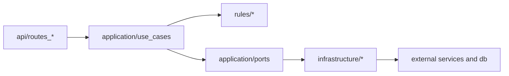

# Backend: переход к более чистому ООП

Документ фиксирует уже внедрённую переходную архитектуру и безопасный путь дальнейшего рефакторинга.

## Что уже внедрено

- В `rules/classification` добавлены объектные сервисы:
  - `ConditionEvaluator`
  - `RuleMatcher`
- Публичные фасады (`evaluate_classification`, `semantic_candidate_matches_class_rule`) сохранены — внешний контракт не меняется.
- Для сценариев API добавлен use-case слой:
  - `CreateExpertDecisionUseCase`
  - `ValidateOfficerDeclarationUseCase` (оркестрация через порт `OfficerPipelineRunnerPort`)
- Добавлены портовые интерфейсы и инфраструктурные адаптеры:
  - `application/ports/repositories.py`
  - `application/ports/external_services.py`
  - `infrastructure/repositories/sqlalchemy_expert_decisions.py`
  - `infrastructure/http/semantic_search_client.py`

## Текущая слоистая схема

## Правила безопасного продолжения

- Не менять shape существующих HTTP-ответов, пока фронтенд не переведён.
- Новую бизнес-логику добавлять в `application/use_cases`, а роуты оставлять тонкими.
- Доступ к БД и внешним сервисам вести через порты/адаптеры.
- Для правил/условий сначала расширять `RuleMatcher`/`ConditionEvaluator`, затем фасады.

## Обязательные проверки на каждом шаге

- `pytest backend/tests/test_classification.py -q`
- `pytest backend/tests/test_pipeline_validator.py -q`
- `pytest backend/tests -q`

